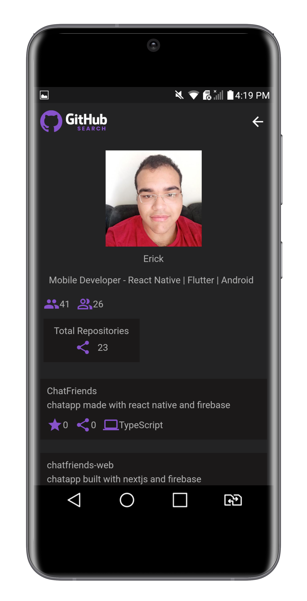

<h1 align="center"> flutter-github-search </h1>

<p align="center">
  <a href="https://github.com/ErickLuizA/flutter-github-search/graphs/commit-activity" alt="Maintenance">
    
  </a>

  <a href="./LICENSE" alt="License: MIT">
    
  </a>

<br/>


<a href="https://github.com/ErickLuizA/flutter-github-search/stargazers">
  
</a>

<p align="center">
  <a href="#clipboard-description">Description</a>&nbsp;&nbsp;&nbsp;|&nbsp;&nbsp;&nbsp;
  <a href="#building_construction-technologies">Technologies</a>&nbsp;&nbsp;&nbsp;|&nbsp;&nbsp;&nbsp;
  <a href="#rocket-getting-started">Getting Started</a>&nbsp;&nbsp;&nbsp;|&nbsp;&nbsp;&nbsp;
  <a href="#memo-license">License</a>&nbsp;&nbsp;&nbsp;|&nbsp;&nbsp;&nbsp;
  <a href="#framed_picture-screenshots">Screenshots</a>
</p>

## :clipboard: Description

flutter-github-search is a app to search people in github built with flutter

## :building_construction: Technologies

- [Flutter](https://flutter.dev/)
  - [dartz](https://pub.dev/packages/dartz)
  - [http](https://pub.dev/packages/http)
  - [provider](https://pub.dev/packages/provider)
  - [flutter_svg](https://pub.dev/packages/flutter_svg)

## :rocket: Getting Started

## 1. Download the repository

```shell
 $ git clone https://github.com/ErickLuizA/flutter-github-search.git

  or

 $ gh repo clone ErickLuizA/flutter-github-search
```

## 2. Installation

```shell
# Go into the repository
$ cd flutter-github-search

# Install dependencies
$ flutter pub get

# or just use your IDE
```

## 3. Execution

```shell
$ flutter run

# or just use your IDE
```

## :framed_picture: Screenshots

<div>
  
  
</div>

## :memo: License

This project is under the MIT license. See the file [LICENSE](LICENSE) for more details.

---

Build with 💙 By [Erick](https://www.linkedin.com/in/erick-luiz-47151a1a4/)
